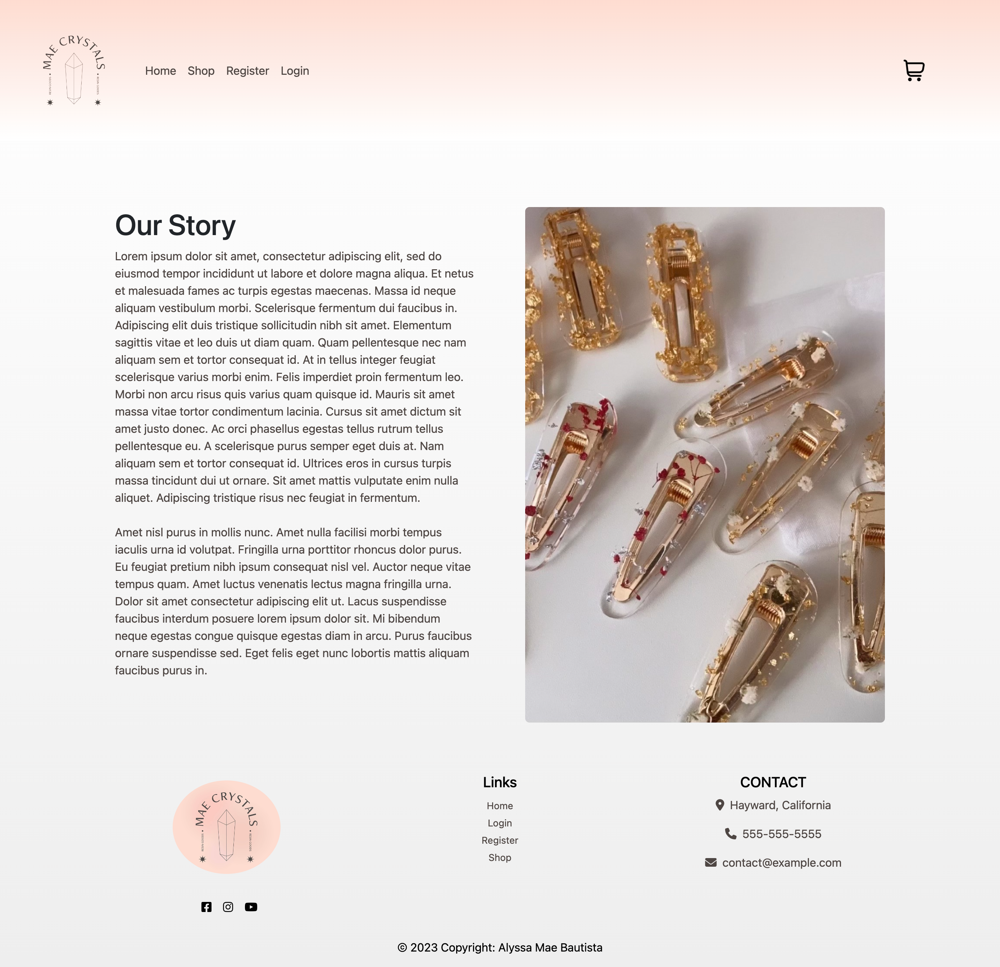
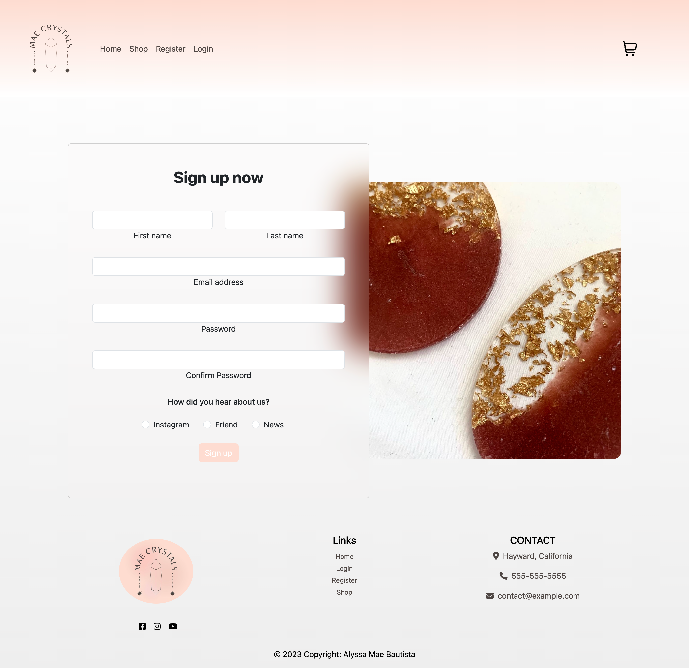
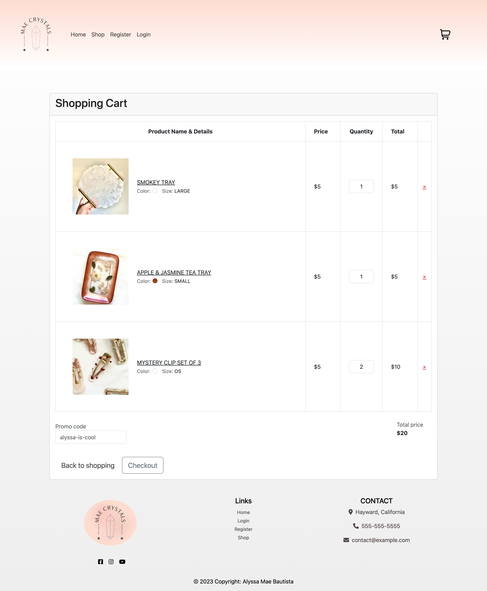

# Capstone Project

This project was to create an e-commerce site that included 5 pages with the use of HTML, CSS, and Bootstrap.

- Home 
- Products
- Registration
- Login
- Checkout

I chose to create a site that sold resin pieces I had sold a few years back with images I already had. 

One interesting piece of css I wrote was being able to blur a card on top of an image background. 
## Features

- Responsive layout
- Cards slide with hover
- Bootstrap navbar

## Images of each site

